# Large Language Models - Aula 01: Introduction - Rodrygo Santos & Anisio Lacerda

## Table of contents

- [Large Language Models - Aula 01: Introduction - Rodrygo Santos \& Anisio Lacerda](#large-language-models---aula-01-introduction---rodrygo-santos--anisio-lacerda)
  - [Table of contents](#table-of-contents)
  - [Imagem](#imagem)
  - [Language](#language)
  - [Image (2)](#image-2)
  - [Notícias](#notícias)
    - [Forbes](#forbes)
    - [The Verge](#the-verge)
    - [TechCrunch](#techcrunch)
    - [Pew Research Center](#pew-research-center)
  - [Imagens e vídeos](#imagens-e-vídeos)
  - [Data Science with OpenAI Codex](#data-science-with-openai-codex)
  - [Your software engineering agent](#your-software-engineering-agent)
  - [The Register](#the-register)
  - [Post](#post)
  - [Language model](#language-model)
  - [Language model](#language-model-1)
  - [Evolution of language models](#evolution-of-language-models)
  - [Tunable dependence via n-grams](#tunable-dependence-via-n-grams)
  - [Improved estimation via smoothing](#improved-estimation-via-smoothing)
  - [Evolution of language models](#evolution-of-language-models-1)
  - [Neurons](#neurons)

## Imagem

[Imagem: Silhouette of a human female on the left and a humanoid AI on the right; a white wire connects their brains through their mouths symbolizing communication. By DALL-E 3]

## Language

- A natural ability for humans
  - Effortless use for communication
  - Expressive of thoughts, emotions, instructions
- A challenge for machines
  - Ambiguity, context-dependency, nuanced semantics
- A milestone towards AGI?

## Notícias

- [Imagem: Welcome to ChatGPT - Hello! How can I help you today? Is there something you need help with or would like to learn more about? I'm here to assist you with any questions you may have.]
- Credits: Shutterstock

---

- Forbes
  - [ChatGPT Is The Fastest Growing App In The History Of Web Applications][LinkForbes]
    - Cindy Gordon
      - Contributor © CEO, Innovation Leader Passionate about Modernizing via AI
      - Feb 2, 2023, 06:24pm EST
  - UBS research just confirmed that ChatGPT is the "fastest-growing consumer application in history," according to research from UBS research just announced that ChatGPT. "In 20 years following the Internet space, we cannot recall a faster ramp in a consumer internet app. By comparison, **TikTok took nine months to reach 100 million monthly users**, and Instagram about 2.5 years." Other popular online services have taken longer to hit the one million user mark. Instagram being the the closest. Another comparison is when Netflix was launched as a subscription service in 1999, the one million user mark took over 3.5 years to reach this many users.
  - **Already at over one million users in just five days since launching** in November, 2002. The conversational AI bot uses AI/ML and NLP (natural Language processing)...

[LinkForbes]: https://www.forbes.com/sites/cindygordon/2023/02/02/chatgpt-is-the-fastest-growing-ap-in-the-history-of-web-applications/

---

- [The Verge][LinkTheVerge]
  - AI
  - by Jon Porter
    - Nov 6, 2023, 3:03 PM GMT-3
    - ChatGPT continues to be one of the fastest-growing services ever / In less than a year, it's hit **100 million weekly users** and over 2 million developers are currently building on the company's API, including the majority of Fortune 500 companies.

[LinkTheVerge]: https://www.theverge.com/2023/11/6/23948386/chatgpt-active-user-count-openai-developer-conference

---

- [The Verge][LinkTheVerge2]
  - AI / OPENAI
  - by Emma Roth
    - Dec 4, 2024, 1:39 PM GMT-3
    - ChatGPT now has over **300 million weekly users**
    - During the NYT's DealBook Summit, OpenAI CEO Sam Altman said users send over **1 billion messages per day** to ChatGPT.

[LinkTheVerge2]: https://www.theverge.com/2024/12/4/24234567/chatgpt-300-million-users-openai-sam-altman

---

- [TechCrunch][LinkTechCrunch]
  - AI
  - Ivan Mehta
    - 8:25 AM PDT - August 4, 2025
  - OpenAI says ChatGPT is on track to reach **700M weekly users**

[LinkTechCrunch]: https://techcrunch.com/2025/08/04/openai-says-chatgpt-is-on-track-to-reach-700m-weekly-users/

---

- [Pew Research Center][LinkPewResearch]
  - Short Reads | June 25, 2025
  - 34% of U.S. adults have used ChatGPT, about double the share in 2023
    - BY OLIVIA SIDOTI AND COLLEEN MCCLAIN
  - The share of Americans who have used [ChatGPT][LinkGPT], an AI chatbot released in November 2022, has roughly doubled since summer 2023. Today, **34% of U.S. adults say they have ever used ChatGPT**, according to a Pew Research Center survey. That includes a 58% majority of adults under 30. Still, **66% of Americans have not used the chatbot, including 20% who say they've heard nothing about it**.

[LinkPewResearch]: https://www.pewresearch.org/short-reads/2025/06/25/34-of-us-adults-have-used-chatgpt-about-double-the-share-in-2023/
[LinkGPT]: https://chatgpt.com/

## Imagens e vídeos

- [Imagem: Create a cinematic, photorealistic medium shot capturing the nostalgic warmth of a late 90s indie film. The focus is a young woman with brightly dyed pink hair...]
- By [Imagen 4][LinkImagen4]

[LinkImagen4]: https://lh3.googleusercontent.com/cdzUZ2dHySgIJSKrZ_-fJyVLcMG8YktAjCFR2Mx8wz3fd-Vg9dTN266PteH-rczn7Pk-y9vPG-KRvCqbAbuNjF0wA681mZZwrOM_qT2bN0orVwtf4A=h1200-rw

---

- [Video: A delicate feather rests on a fence post. A gust of wind lifts it, sending it dancing over rooftops. It floats and spins, finally caught in a spiderweb on a high balcony.]
- By [Vion 3][LinkVion3]

[LinkVion3]: https://deepmind.google/api/blob/website/media/veo__veo-3__us_wm_a-delicate-feather-rests-on-a-fence-post-a-gust-of-wind-lifts-it.mp4

## [Imagem: Yoda meditates in a forest setting on the planet Dagobah; suddenly, he awakens from his meditation, looks at the camera, and says: "To the course on Large Language Models, welcome you are." By Veo 3]

## Transform your content into engaging AI-generated audio discussions

- You're already on the waitlist! We'll notify you when it's your turn to try illuminate.
- Attention Is All You Need
  - 4 min
  - View Source View Transcript
  - Play
- Generative Agents: Interactive Simulacra of...
  - 5 min
  - View Source View Transcript
  - Play
- Artificial Intelligence Index Report 2024
  - 8 min
  - View Source View Transcript
  - Play
- Large Language Models Encode Clinical Knowledge
  - 3 min
  - View Source View Transcript
  - Play
- Fuller library
  - **Pal.M-E-An Embodied Multimodal...**
  - 4 min
  - View Source View Transcript
  - Play
- Position: Levels of AGI for Operationalizing...
  - 4 min
  - View Source View Transcript
  - Play

---

- **Attention Is All You Need**

## 1.0.3 AM

- Allsharements working!

---

- **By Google**

## Data Science with OpenAI Codex

## Your software engineering agent

- **Drafts GitHub PRs in parallel**
  - Get a first pass for every bugfix, doc update, or small feature.
- **Navigates your codebase**
  - Finds bugs, reviews code, and suggests improvements.
- **Runs lint and tests**
  - Set up dependencies to enable execution.
- **Powered by a new coding model**
  - Fine-tuned to work in large codebases.

---

- Environments
  - **Documents**
    - Take a look at my current project and recommend 3 optimizations. Create a plan and tasks for each of them.
  - **Code**

## The Register

- Al + ML
  - 131
- Mamas, don't let your babies grow up to be coders, Jensen Huang warns
- **Maker of ML accelerators wants more people to use ML**
- Brandon Vigliardo
- Tue 27 Feb 2024 06:30 UTC

---

- Credit: The Register
- Nvidia CEO Jensen Huang believes AI has advanced to the point at which it's no longer necessary to prioritize computer science and coding education for the world's youth.
- Apologies to the past decade of CompSci grads, but your college years would have been better spent gaining expertise in areas like science, manufacturing or farming. Huang declared at the recent World Governments Summit in Dubai.
- "You probably recall over the course of the last 10, 15 years almost everybody who sits on a stage like this would tell you it is vital that children learn computer science," Huang explained during a talk about the future of AI. "Now, it's almost the complete opposite."

## Post

- Sebastian Raschka
  - @rasbt
- Job roles in 2027: We let LLMs focus on the "how". We focus on the "why".

---

- **Programmer → Code Composer**
  - Before: Writing code line by line
  - After: Designing logic & structuring systems
- Web Dev → Experience Designer
  - Before: Building layouts and components
  - After: Defining flow, behavior, and structure
- Data Scientist → Analytics Strategist
  - Before: Cleaning data, structuring queries
  - After: Framing questions, interpreting outcomes
- 11:06 am · 27 Jun 2025 · **40.5K** Views
- [ ] 27
- [ ] 85
- [ ] 469
- [ ] 207

---

- Post your reply

---

- Relevant people
  - **Sebastian Rasch...**
    - @rasbt
    - ML/AI researcher & former stats professor turned LLM research engineer. Author of "Build a Large Language Model From Scratch" (amzn.to/4fqvnOD).

---

- What's happening
  - **NFL Top 100 Countdown**
    - LIVE
  - Trending in Brazil
    - HUGO MOTTA TRAIDOR
    - 98.6K posts
  - Trending in Brazil
    - Coracao de Ferro
    - 1,271 posts
  - Trending in Brazil
    - Panda

## Language model

- A probability distribution over word sequences
  - $$ P("Today is Wednesday") \approx 0.001 $$
  - $$ P("Today Wednesday is") \approx 0.0000000000001 $$
  - $$ P("The eigenvalue is positive") \approx 0.00001 $$
- Also a mechanism for "generating" text
  - $$ P("Wednesday'|"Today is") > P("blah'|"Today is") $$

## Language model

- Ideal (aka full dependence) model
  - $$ P(w*1 ... w_k) = P(w_1)P(w_2|w_1) ... P(w_k|w_1 ... w*{k-1}) $$
- **Infeasible in practice**
  - Expensive computation
  - Poor estimation (data sparsity)

## Evolution of language models

- Statistical LMs
  - (1950s-1990s)

## Tunable dependence via n-grams

- 3-gram ("trigram")
  - $$ P(w*1 ... w_k) = P(w_1)P(w_2|w_1) ... P(w_k|w*{k-2}, w\_{k-1}) $$
- 2-gram ("bigram")
  - $$ P(w*1 ... w_k) = P(w_1)P(w_2|w_1) ... P(w_k|w*{k-1}) $$
- 1-gram ("unigram")
  - $$ P(w_1 ... w_k) = P(w_1)P(w_2) ... P(w_k) $$

## Improved estimation via smoothing

- $$ P(w) $$
  - maximum likelihood estimation
  - smoothed estimation

## Evolution of language models

- Statistical LMs
  - (1950s-1990s)
- Neural LMs
  - (2013)

## Neurons

```mermaid
flowchart LR
    A[input<br>W<sub>1: t-1</sub>] --> B[dense network]
    B --> C[output<br>Ŵ<sub>t</sub>]
```



````

- Improved word-level representation
  - From sparse to distributional semantics
  - Better generalization to unseen data
- Context still lacking
  - Fixed-length input and output
  - Non-sequential representation


## Neurons... with recurrence


---


- Sequential bless
  - Dynamic state maintains linguistic context
  - Enables handling variable-length sequences
- Sequential curse
  - Single state as information bottleneck
  - Inherently non-parallelizable


## Evolution of language models

- Statistical LMs
  - (1950s-1990s)
- Neural LMs
  - (2013)
- Pretrained LMs
  - (2018)


## Attention Is All You Need

- Ashish Vaswani\*
  - Google Brain <avaswani@google.com>
- Llion Jones\*
  - Google Research <llion@google.com>
- Noam Shazeer\*
  - Google Brain <noam@google.com>
- Niki Parmar\*
  - Google Research <nikip@google.com>
- Jakob Uszkoreit\*
  - Google Research <usz@google.com>
- Aidan N. Gomez\*†
  - University of Toronto <aidan@cs.toronto.edu>
- Lukasz Kaiser\*
  - Google Brain <lukaszkaiser@google.com>
- Illia Polosukhin\*†
  - <illia.polosukhin@gmail.com>

---

- Vaswani et al. (NIPS 2017)


## Neurons... with attention

```mermaid
flowchart LR
    A[input<br>W<sub>1: t-1</sub><br>The animal didn't cross the street because it was too ______] --> B[attention]
    B --> C[output<br>Ŵ<sub>t</sub>]
```



---


---


---


---


## Attention is (not) all you need

- **Prediction:** select best output; decode
- **Enrichment:** attend to multiple contexts; add nonlinearities
- **Preparation:** tokenize; mark position; encode


## Transformer

```mermaid
flowchart TD
    A[W<sub>1:t-1</sub>] --> B[Transformer]
    B --> C[Ŵ<sub>t</sub>]
```



- Effective representation
  - Can attend to entire context – no bottleneck
  - Attention heads as representation subspaces
  - Order retained via positional encoding
- Efficient processing
  - Parallelization across tokens and heads
  - Much faster training and inference
  - Scalability to massive training datasets


## Transformer architectures

- **Encoder-only**
  - (e.g. BERT (2018))
- **Encoder-decoder**
  - (e.g. T5 (2019))
- **Decoder-only**
  - (e.g. GPT (2018))
- **Decoder-only**
  - (e.g. GPT (2018))


## The power of transfer learning

- Self-supervised pretraining (expensive)
  - Standard language modeling objective
  - Train on massive textual corpora
- Supervised fine-tuning (cheap)
  - Multiple task-specific objectives
  - Improved performance downstream


## Evolution of language models

- Statistical LMs
  - (1950s-1990s)
- Neural LMs
  - (2013)
- Pretrained LMs
  - (2018)
- Large LMs
  - (2020)


## Model size vs. time


- GPT-1
  - 117M
- GPT-2
  - 1.5B


## Model size vs. time


- GPT-1
  - 117M
- GPT-2
  - 1.5B
- GPT-3
  - 175B


## Model size vs. time


- Are you guys still there?
- GPT-1 117M
- GPT-2 1.5B
- GPT-3 175B
- GPT-4 1.76T\*


## Model size vs. time

- Advent of the Transformer
- Availability of massive datasets
- Access to powerful computing
- GPT-4
  - 1.76T\*
- 2018 2019 2020 2021 2022 2023 2024 2025


## The power of scaling

- LLMs show improved performance with scale
  - Increased model size (in trillions of parameters)
  - Increased training size (in trillions of tokens)
- Improvements in next token prediction
  - But also in unforeseen capabilities!


## Instruction following

- **PROMPT**
  - Classify this review:
    - I loved this film!
  - Sentiment:
- **COMPLETION**
  - Positive
- LLM


## Instruction following

- **PROMPT**
  - Classify this review:
    - I loved this film!
  - Sentiment:
- **COMPLETION**
  - received a very nice book review
- **LLM**


## In-context learning

- **PROMPT**
  - Classify this review:
    - I don't like this chain!
  - Sentiment: Negative
  - CLASSify this review:
    - I loved this film!
  - Sentiment:
- **COMPLETION**
  - Positive
- **LLM**


## Complex reasoning

- PROMPT
  - Q: Roger has 5 tennis balls. He buys 2 more cans of tennis balls. Each can has 3 tennis balls. How many tennis balls does he have now?
  - A: The answer is 11.
  - Q: The cafeteria had 23 apples. If they used 20 to make lunch and bought 6 more, how many apples do they have?
- COMPLETION
  - A: The answer is 27.
- LLM


## Chain-of-thought prompting

- PROMPT
  - Q: Roger has 5 tennis balls. He buys 2 more cans of tennis balls. Each can has 3 tennis balls. How many tennis balls does he have now?
  - A: Roger started with 5 balls. 2 cans of 3 tennis balls each is 6 tennis balls. 5 + 6 = 11. The answer is 11.
  - Q: The cafeteria had 23 apples. If they used 20 to make lunch and bought 6 more, how many apples do they have?
- COMPLETION
  - A: The cafeteria had 23 apples originally. They used 20 to make lunch. So they had $$ 23-20 = 3 $$. They bought 6 more apples, so they have $$ 3 + 6 = 9 $$. The answer is 9.


## Basic, emerging, augmented capabilities!


## Post

- Andrej Karpathy
  - @karpathy
- Today marks the release of GPT4.5 by OpenAI. I've been looking forward to this for ~2 years, ever since GPT4 was released, because this release offers a qualitative measurement of the slope of improvement you get out of scaling pretraining compute (i.e. simply training a bigger model). Each 0.5 in the version is roughly 10X pretraining compute. Now, recall that GPT1 barely generates coherent text. GPT2 was a confused toy. GPT2.5 was "skipped" straight into GPT3, which was even more interesting. GPT3.5 crossed the threshold where it was enough to actually ship as a product and sparked OpenAI's "ChatGPT moment". And GPT4 in turn also felt better, but I'll say that it definitely felt subtle. I remember being a part of a hackathon trying to find concrete prompts where GPT4 outperformed 3.5. They definitely existed, but clear and concrete "slam dunk" examples were difficult to find. It's that ... everything was just a little bit better but in a diffuse way. The word choice was a bit more creative. Understanding of nuance in the prompt was improved. Analogies made a bit more sense. The model was a little bit funnier. World knowledge and understanding was improved at the edges of rare domains. Hallucinations were a bit less frequent. The vibes were just a bit better. It felt like the water that rises all boats, where everything gets slightly improved by 20%. So it is with that expectation that I went into testing GPT4.5, which I had access to for a few days, and which saw 10X more pretraining compute than GPT4. And I feel like, once again, I'm in the same hackathon 2 years ago. Everything is a little bit better and it's awesome, but also not exactly in ways that are trivial to point to. Still, it is incredible interesting and exciting as another qualitative measurement of a certain slope of capability that comes "for free" from just pretraining a bigger model. Keep in mind that that GPT4.5 was only trained with pretraining.

---

- Relevant people
  - Andrej Karpathy
    - @karpathy
    - Building @Eurekal.absAI. Previously Director of AI @ Tesla, founding team @ OpenAI, CS231n/PhD @ Stanford. I like to train large deep neural nets

---

- What's happening
  - NFL Top 100 Countdown
    - LIVE
- Creating an Extended Approach
  - Trending in Brazil
    - Mercosul
    - 2,203 posts
  - Trending in Brazil
    - Malcom
    - 3,129 posts
  - Trending in Brazil
    - #historiadeamor


## Post

- Gary Marcus
  - @GaryMarcus

---

- What a difference a week makes
- Sam Altman, Thursday, at the GPT-5 livestream: "GPT is a major upgrade in a significant step along our path toward AGI"
- Sam Altman, today, after people rebelled against GPT-5: AGI is "not a super useful term"
- Grifters gotta grift.

---

- CNBC
  - - Follow
- LJM Followers

---

- Sam Altman now says AGI, or human-level AI, is 'not a super useful term' — and he's not alone
- Story by Ryan Browne • 17h • 💬 3 min read

---

- Credit: @GaryMarcus
- Last edited 1:32 am · 12 Aug 2025 · 11.9K Views

---

- Referant people
  - Gary Marcus
    - @GaryMarcus
- Following
  - Built two AI companies, wrote six books, tried to warn you about a lot of things.

---

- What's happening
  - Trending in Brazil
    - Talles
    - 3,137 posts
  - Trending in Brazil
    - EDUARDO BOLSONARO CASSADO JA
    - 19.6K posts
  - Trending in Brazil
    - fluminense x vasco
  - Trending in Brazil
    - IBGE
  - Show more


## The challenges of scaling

- System challenges
  - Substantial compute and energy consumption
  - Continual learning and adaptation
- Data challenges
  - Data quality and representativeness
  - Low-resource domains and languages


## Idea #1: Go multimodal


## OpenAI

- Research
- Products
- Safety
- Company
- May 13, 2024
- Hello GPT-40
- We're announcing GPT-40, our new flagship model that can reason across audio, vision, and text in real time.
- Contributions > Try on ChatGPT ➤
- All videos on this page are at 1x real time.


## [Imagem: Credit: OpenAI]


## Idea #2: Think first


## Learning to Reason with LLMs

- We are introducing OpenAI of, a new large language model trained with reinforcement learning to perform complex reasoning. Of thinks before it answers —it can produce a long internal chain of thought before responding to the user.
- Contributions
  - OpenAI of ranks in the 88th percentile on competitive programming questions (Codeforces), places among the top 500 students in the US in a qualifier for the USA Math Olympiad (AME), and exceeds human PhD-level accuracy on a benchmark of physics, biology, and chemistry problems (GPQA). While the work needed to make this new model as easy to use as current models is still ongoing, we are releasing an early version of this model, OpenAI of-preview, for immediate use in ChatGPT and to trusted API users.
  - Our large-scale reinforcement learning algorithm teaches the model how to think productively using its chain of thought in a highly data-efficient training process. We have found that the performance of of consistently improves with more reinforcement learning (train-time compute) and with more time spent thinking (test-time compute). The constraints on scaling this approach differ substantially from those of LLM pretraining, and we are continuing to investigate them.

---

- Credit: OpenAI


## [Imagem: Credit: OpenAI]


## Idea #3: Be efficient


## The efficiency challenge

- Building LLMs demands substantial resources
  - Training requires massive data and hardware
  - Fine-tuning can also be resource-intensive
- Deploying LLMs is also expensive
  - Inference (using the model) can be slow and costly
  - Limited accessibility due to high computational costs


## Model size vs. time


- GPT-1
  - 117M
- GPT-2
  - 1.5B
- GPT-3
  - 175B
- GPT-4
  - 1.76T\*
- GPT-5
  - 300B\*


## Why efficient LLMs matter?

- **Economy:** make training and inference more affordable
- **Accessibility:** enable wider use across applications
- **Democratization:** enable smaller groups
- **Sustainability:** lower energy consumption
- **Innovation:** enable quicker iterations
- **New applications:** facilitate use on edge devices


## OpenAI

- August 5, 2025
- Release
- Product
- Introducing gpt-oss
- gpt-oss-120b and gpt-oss-20b push the frontier of open-weight reasoning models
- We're releasing gpt-oss-120b and gpt-oss-20b—two state-of-the-art open-weight language models that deliver strong real-world performance at low cost. Available under the flexible Apache 2.0 license, these models outperform similarly sized open models on reasoning tasks, demonstrate strong tool use capabilities, and are optimized for efficient deployment on consumer hardware. They were


## Course goals

- Understand the fundamentals of an LLM
- Explore the capabilities and limitations of LLMs
- Have a grasp of where the field is headed


## Course scope (tentative)

- Fundamentals
  - o Data: sources, curation, preparation
  - Architecture: transformer core,variants
  - Optimization: pretraining, post-training


## Course scope (tentative)

- Capabilities
  - Reasoning: chain-of-thought, planning
  - Augmentation: RAG, tool use, external memory
  - Orchestration: multi-agent coordination, workflows
  - Multimodality: structured and non-textual data


## Course scope (tentative)

- Improvement
  - o Interpretability: explainability, probing, attribution
  - o Causality: causal reasoning, counterfactuals, biases
  - Efficiency: compression, pre/post-training, inference


## Course grading (tentative)

- Midterm and final exam: 40%
- Programming exercises: 10%
- Research seminars: 10%
- Course project: 40%


## Course attendance

- Os creditos relativos a cada disciplina so serao conferidos ao aluno que obtiver, no minimo, o conceito $$ D $$ e que comprovar efetiva frequencia $$ a $$, no minimo, 75% (setenta e cinco por cento) das atividades em que estiver matriculado, vedado o abono de faltas.
- NGG, art. 12 / NGPG, art. 65


## Course materials: books

- Build a Large Language Model (from Scratch)
  - by Raschka (2024)
- Hands-On Large Language Models
  - by Alammar and Grootendorst (2025)
- Speech and Language Processing
  - by Jurafsky and Martin (2023)


## Course materials: courses and tutorials

- Generative AI with Large Language Models
  - by DeepLearning.AI/AWS
- Build a Large Language Model (From Scratch)
  - by Raschka
- Neural Networks: Zero to Hero
  - by Karpathy


## Pre-course survey

- Fill in a short survey describing your past experience and expectations related to the course
- <https://forms.gle/7mcatGc5LtAFM2ta7>


## UFMG

- UNIVERSIDADE FEDERAL
- DE MINAS GERAIS
- Coming next...
- Lifecycle of LLMs
- Rodrygo Santos
- Anisio Lacerda
````
